# AI Service Architecture — Agentic AI Work OS

## Scope

This document covers **only the AI service** of the Agentic AI Work OS.  
It does **not** cover the frontend app or the backend API service except where they interface with the AI service.

The AI service is responsible for:

- interpreting user goals
- generating milestone-based plans
- decomposing milestones into tasks
- critiquing and revising plans
- routing tasks for execution
- invoking core capabilities such as knowledge retrieval
- resolving integrations such as Notion and RAG
- preparing the system for async workers, memory, and future multi-agent orchestration

---

# 1. Exact Architecture of the AI Service

## 1.1 Core architectural principle

The AI service is designed as an **intelligence and decisioning engine**, not as the full application state owner.

It is organized into the following internal layers:

1. **API Layer**  
   FastAPI routes that expose well-defined endpoints.

2. **Schema Layer**  
   Pydantic models that enforce structured contracts across the system.

3. **Planning Layer**  
   Goal interpretation, milestone planning, task decomposition, and plan finalization.

4. **Evaluation Layer**  
   Critique and revision loop for improving plan quality.

5. **Execution Layer**  
   Classifies tasks into suggest / auto-execute / requires approval / manual.

6. **Capability Layer**  
   Abstract system capabilities such as `retrieve_knowledge`, `generate_content`, `store_data`, `schedule`, and `notify`.

7. **Integration Layer**  
   Concrete adapters and services such as Notion and RAG.

8. **LLM Layer**  
   Prompt builders, model invocation wrapper, and structured-output parsing.

9. **RAG / Knowledge Layer**  
   Retrieval and grounded generation for common system-wide knowledge access.

10. **Persistence / Memory Layer (current and planned)**  
    Intended for PostgreSQL, Qdrant, and future memory/context pipelines.

---

## 1.2 Current high-level flow

The current AI service flow for a planning request is:

1. Receive raw goal input
2. Interpret raw goal into structured goal metadata
3. Generate milestone plan
4. Generate tasks per milestone
5. Finalize initial plan
6. Critique plan quality
7. Revise plan if score is below threshold
8. Route tasks for execution
9. Resolve capability and integration when execution is triggered
10. Return structured plan and execution decisions

---

## 1.3 Current project structure

```text
ai-service/
  app/
    main.py
    api/
      routes/
        health.py
        goals.py
        planning.py
        evaluation.py
        execution.py
    core/
      config.py
      logger.py
    schemas/
      common.py
      goal.py
      task.py
      plan.py
      evaluation.py
      execution.py
      tool.py               # planned / evolving
    services/
      llm/
        client.py
        structured_output.py
        prompts/
          goal_interpreter.py
          milestone_planner.py
          task_planner.py
          critic.py
          plan_reviser.py
          execution_router.py
      planner/
        goal_interpreter.py
        milestone_planner.py
        task_decomposer.py
        plan_finalizer.py
      evaluator/
        plan_critic.py
        plan_reviser.py
      execution/
        router.py
        approval_policy.py
        capability_registry.py
        integration_resolver.py
        executor.py
      tools/                # planned dynamic tooling layer
        generator.py
        registry.py
        validator.py
    integrations/
      notion/
        notion_adapter.py
    rag/
      service.py
      retrieval/
        retriever.py
      generation/
        answer_generator.py
```

---

# 2. Architectural View

## 2.1 Layered architecture diagram

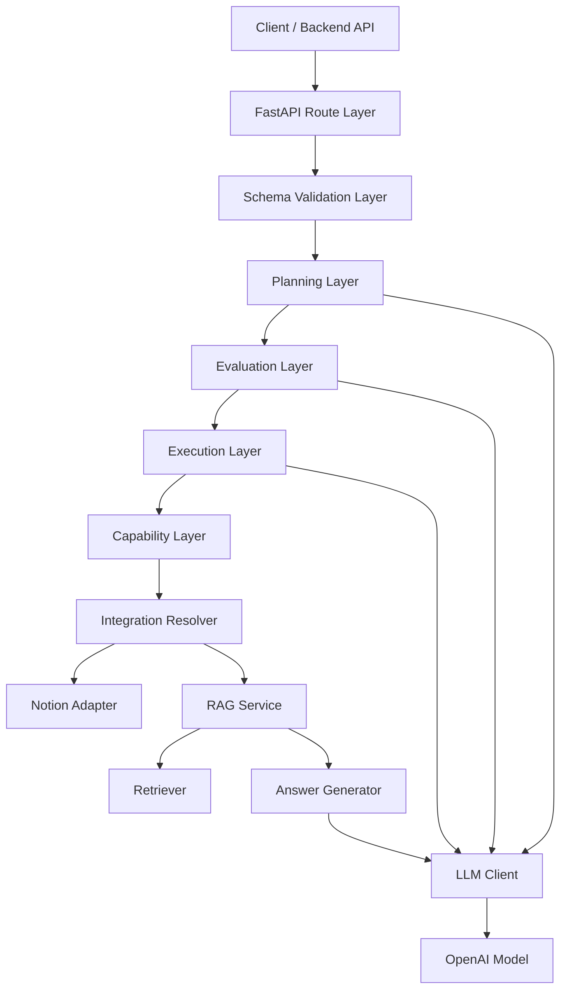

### Explanation

This is the current end-to-end architecture of the AI service.

- The **route layer** exposes REST endpoints.
- The **schema layer** validates inputs and outputs using Pydantic.
- The **planning layer** generates the first version of the plan.
- The **evaluation layer** critiques and revises that plan.
- The **execution layer** determines whether tasks should be suggested, executed, or approval-gated.
- The **capability layer** abstracts the system’s available actions.
- The **integration resolver** maps abstract capabilities to concrete services.
- The **RAG service** is designed as a universal core capability, not as a study-only tool.
- The **LLM client** is shared across planning, evaluation, and generation.

---

# 3. Component Diagram

## 3.1 AI service component diagram

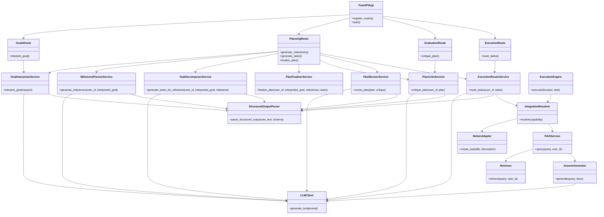

### Explanation

This component diagram shows the major internal services and their relationships:

- **Routes** orchestrate but should not contain business logic.
- **Planner services** own interpretation and plan generation.
- **Evaluator services** own plan quality checks and revision.
- **Execution services** own action decisions and integration routing.
- **LLM and structured parsing** are shared infrastructure.
- **RAG and Notion** are concrete integrations currently attached to execution.

---

# 4. Use Case Diagram

## 4.1 AI service use cases

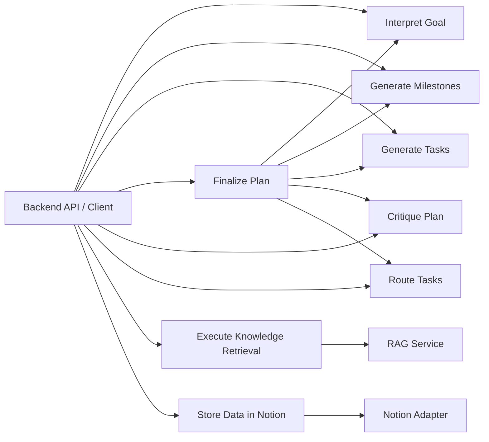

### Explanation

The main actor interacting with this service is the **backend API** or an internal client.

Primary AI service use cases are:

- **Interpret Goal**  
  Transform user intent into a structured goal object.

- **Generate Milestones**  
  Split the goal into major phases.

- **Generate Tasks**  
  Decompose each milestone into actionable steps.

- **Finalize Plan**  
  Combine the previous steps and return a usable plan.

- **Critique Plan**  
  Evaluate plan quality and detect flaws.

- **Route Tasks**  
  Decide what the system can do automatically.

- **Execute Knowledge Retrieval**  
  Use the common RAG capability.

- **Store Data in Notion**  
  Persist tasks or outputs using a concrete adapter.

---

# 5. Sequence Diagrams

## 5.1 Goal interpretation sequence

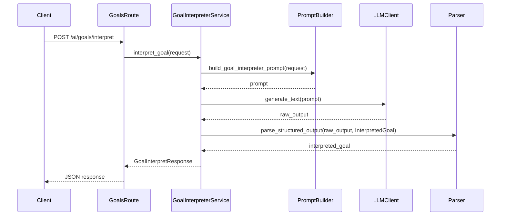

### Explanation

This sequence shows the first AI step:

- The route receives input.
- The service builds a dedicated prompt.
- The LLM client generates raw output.
- The parser validates the response into the target schema.

This pattern is reused across most AI modules.

---

## 5.2 Full planning + critique + revision flow

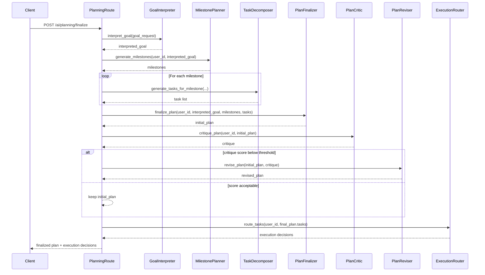

### Explanation

This is the core orchestration sequence of the AI service:

1. Interpret the goal
2. Generate milestones
3. Generate tasks per milestone
4. Assemble initial plan
5. Critique it
6. Revise it if necessary
7. Route tasks for execution
8. Return plan plus decision metadata

This is the current central intelligence pipeline of the project.

---

## 5.3 Execution + integration resolution sequence

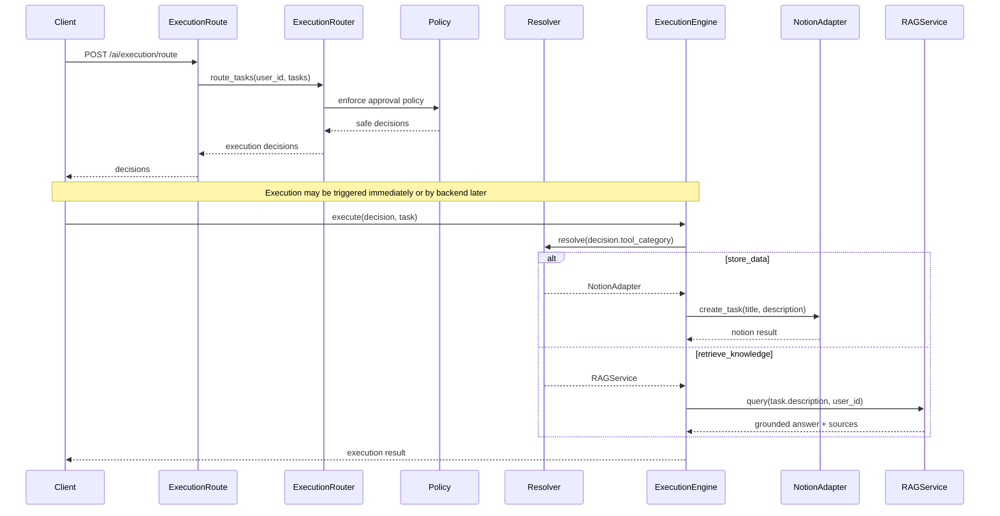

### Explanation

The execution path is intentionally split into two stages:

- **Routing stage**  
  Decide what should happen and whether approval is required.

- **Execution stage**  
  Resolve abstract capabilities to concrete integrations and carry out the action.

This keeps AI decisioning separate from actual side effects.

---

# 6. Activity Diagram

## 6.1 Planning and execution activity flow

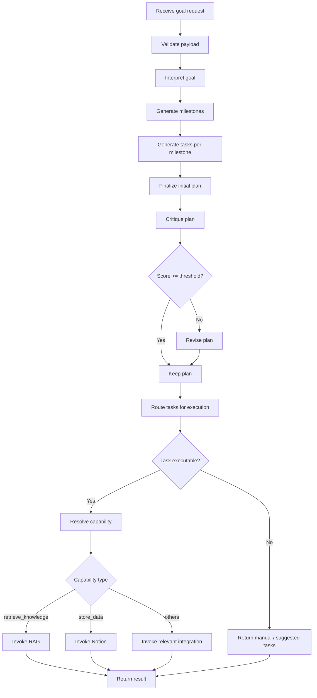

### Explanation

This activity diagram shows the control flow of the AI service from request intake to decisioned execution.  
The most important branching points are:

- **Critique threshold** for deciding whether revision is needed
- **Execution eligibility** for deciding whether a task should be run
- **Capability routing** for selecting the correct integration

---

# 7. State Diagram

## 7.1 Plan lifecycle state machine

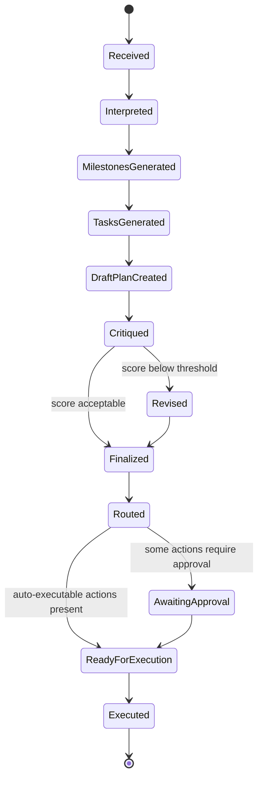

### Explanation

This state machine describes the lifecycle of a plan inside the AI service:

- the plan begins as raw input
- becomes interpreted and structured
- is expanded into milestones and tasks
- is critiqued and optionally revised
- is routed for action
- may wait for human approval
- then becomes ready for execution

This state model is also useful later for backend persistence and audit history.

---

# 8. Data Model Diagram

## 8.1 Core schema relationships

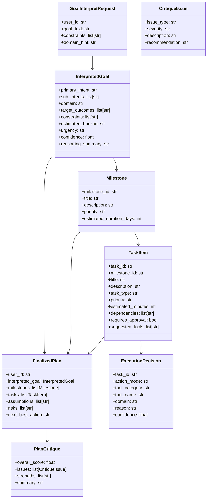

### Explanation

This diagram represents the main schema flow of the AI service:

- raw goal input becomes an `InterpretedGoal`
- interpreted goal expands into milestones
- milestones expand into tasks
- tasks and milestones combine into `FinalizedPlan`
- `FinalizedPlan` is evaluated through `PlanCritique`
- each task is mapped to an `ExecutionDecision`

This is the backbone of the service contract design.

---

# 9. RAG Architecture Diagram

## 9.1 Common knowledge retrieval architecture

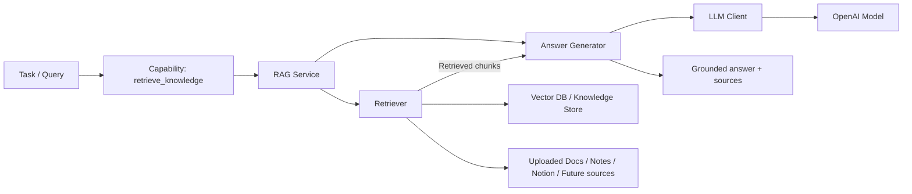

### Explanation

RAG is positioned as a **common system capability**, not as a study-only integration.

It is meant to support:

- study planning
- concept explanation
- contextual answering
- future memory-augmented planning
- knowledge grounding across all domains

This makes the RAG layer reusable everywhere in the AI service.

---

# 10. Deployment View

## 10.1 AI service deployment context

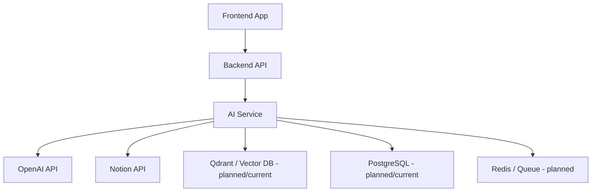

### Explanation

Although this document focuses on the AI service, deployment-wise it sits between the application backend and its external intelligence/integration dependencies.

- **Backend API** handles authentication and primary app orchestration
- **AI service** handles intelligence and execution decisioning
- **OpenAI** provides generation and critique reasoning
- **Notion** is used for concrete task persistence
- **Qdrant/PostgreSQL/Redis** support retrieval, memory, and async execution

---

# 11. Design Decisions

## 11.1 Why planning is milestone-based

Milestone-first decomposition is more reliable than generating a full task tree in one shot because:

- it reduces LLM drift
- it creates clearer structure
- it supports critique and revision more cleanly
- it improves explainability for users

---

## 11.2 Why critique is a separate phase

The critique layer exists because generation alone is not enough.

Benefits:
- catches vague tasks
- catches missing dependencies
- improves reliability
- makes the system feel more like an actual planner rather than a prompt wrapper

---

## 11.3 Why execution is capability-based

The AI service should reason in terms of **capabilities**, not raw APIs.

Example:
- `retrieve_knowledge`
- `store_data`
- `notify`
- `schedule`

This prevents the LLM from being tightly coupled to Gmail, Notion, LinkedIn, or other specific APIs.

---

## 11.4 Why RAG is core, not domain-specific

RAG is a universal need across domains:

- study
- jobs
- fitness
- projects
- general planning

By making it a core system capability, the architecture becomes cleaner and more reusable.

---

## 11.5 Why AI should not directly call arbitrary APIs

The system separates:
- **decisioning** from
- **execution**

This reduces:
- hallucinated integrations
- unsafe actions
- brittle architecture
- uncontrolled side effects

---

# 12. Current Strengths and Gaps

## 12.1 Current strengths

The current AI service already has strong architectural qualities:

- clean route/service separation
- strict schema-driven outputs
- layered planning pipeline
- critique and revision loop
- execution decisioning
- capability-based integration direction
- RAG as a common system capability

---

## 12.2 Current gaps / next extensions

The next major improvements for the AI service are:

1. **Memory Layer**
   - PostgreSQL for structured memory
   - Qdrant for semantic memory
   - context builder for personalization

2. **Async Execution**
   - queue-based workers
   - task status tracking
   - retries and execution logs

3. **Tool Registry / Dynamic Tool Synthesis**
   - controlled tool generation
   - validation layer
   - reusable registry

4. **Multi-agent orchestration**
   - planner agent
   - executor agent
   - critic agent
   - memory/retrieval agent

5. **Observability**
   - trace IDs
   - prompt logging
   - token usage
   - latency metrics
   - execution audits

---

# 13. Recommended final mental model

The AI service today should be understood as:

> A schema-driven, layered intelligence service that interprets user goals, creates and evaluates plans, routes tasks into abstract capabilities, and uses controlled integrations such as RAG and Notion to support grounded execution.

That is the exact architecture of the project’s AI service as it stands now.
